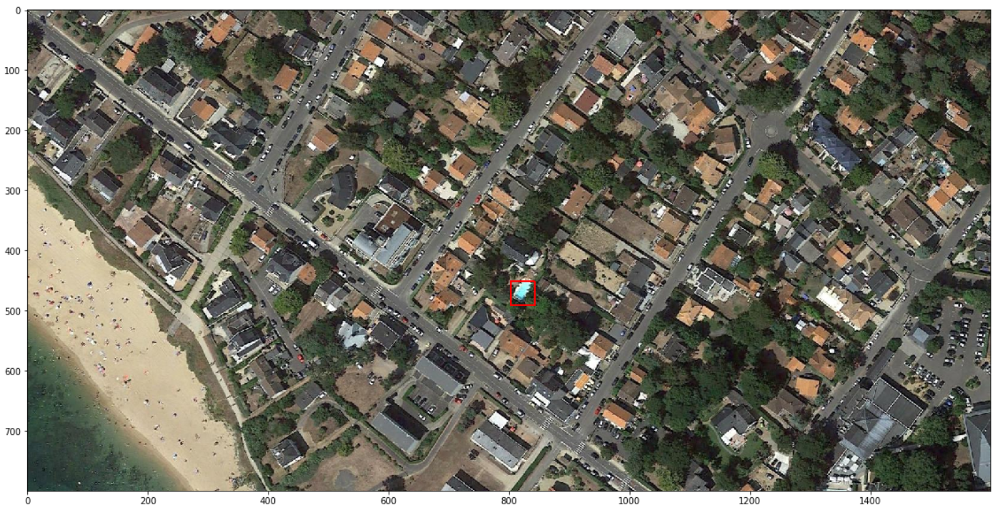

# Swimming Pool Detection on Aerial Images

One-day project ✍(◔◡◔)

## Problematic

Detect pools on aerial images. Can be used for market analysis for a swimming pool seller or fight against tax evasion of undeclared swimming pools: [12,000 illegal swimming pools detected in Provence thanks to artificial intelligence](https://www.francebleu.fr/infos/societe/dans-le-var-deja-4000-piscines-non-declarees-detectees-grace-a-l-intelligence-artificielle-1642074759).

## Proposed Approach

### Data

- 50x50px tiles containing a pool or not.
- ~1500 tiles for positive class, ~1500 for negative class.
- No segmentation masks, no coordinates. Just `pool` or `no pool` for each tile.
- Private dataset ¯\\\_(ツ)_/¯

### Algorithm

- Convolutional Neural Network (resnet50) with class activation maps to generate a heatmap. Simple computer vision algorithms to detect "blobs" and return the swimming pools' coordinates.
- Inference is done on 800x1600px images. No need to split the image into 50x50 patches since the network uses a Global Average Pooling layer.
- Network is trained with simple data aug, Adam (with lr=3e-4 [(¬‿¬)](https://twitter.com/karpathy/status/801621764144971776)).

1) Class Activation Maps on tiles
    
    
2) Input image
    
3) Heatmap generated by the CNN
    
4) Binarization and contour detection
    
5) Draw bounding boxes
    

## Results
<details>
  <summary>Result 1</summary>
    


</details>
<details>
  <summary>Result 2</summary>
    


</details>
<details>
  <summary>Result 3</summary>
    


</details>
<details>
  <summary>Result 4</summary>
    


</details>
<details>
  <summary>Result 5</summary>
    


</details>

## Some Remarks

- HSV filtering before feeding a tile in the CNN might improve the results...?
- Binarization and contour detection need some finetuning.

## Repo structure

```txt
├── README.md
├── pool_detection_example_notebook.ipynb     <- notebook for inference with some visualizations
├── models                                    <- model weights
├── src
│   ├── pool_detector.py                      <- inference
│   ├── data
│   │   └── split_dataset.py                  <- generate train/test/valid sets
│   ├── models
│   │   ├── predict_cnn.py                    <- check results
│   │   └── train_cnn.py                      <- train cnn
```
